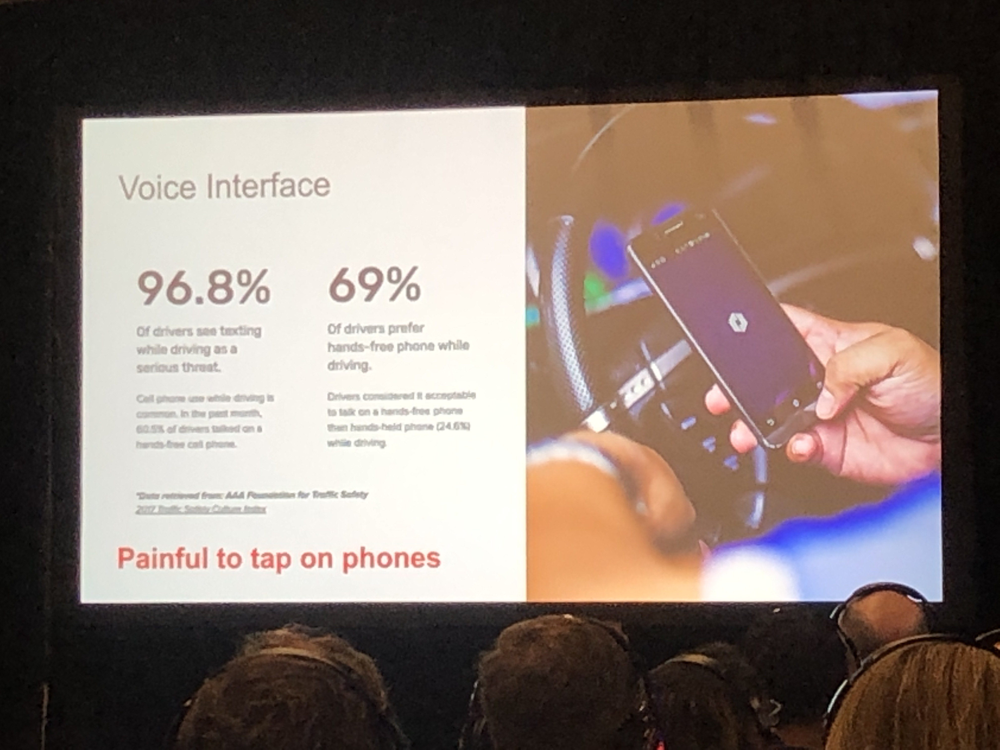
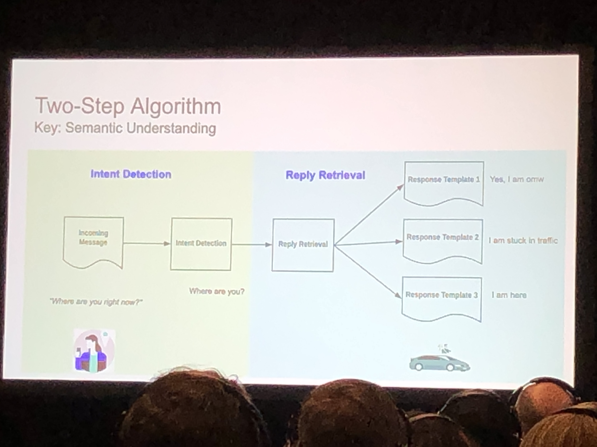
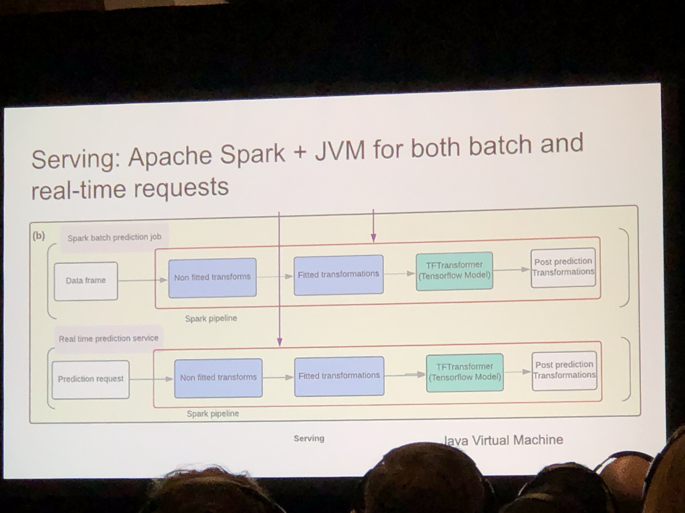

# ai_summit_sf_2019_notes

Notes from AI Summit (San Francisco) in 2019

## MLOps - Where ML models meet the real world
Dan Darnell, Sr Dir of MLOps Products, DataRobot

[Slide deck](slide/MLOps_AI_Summit_SF_DataRobot.pdf)

## IIoT enabled transformation of manufacturing at Ford
Rajeev Kalamdani, Sr Mgr, IIoT & Analytics, Ford

* Predict equipment behavior to prevent downtime - 0.5 - 1M different equipments at 80 sites around the globe, potentially lots of potential
* Improve the end of the line quality processes
    * Help technician to identify the potential problems using recommender systems using historical data of the population
* Use cameras to improve detection of paint defects
* Find where a vehicle is in the factory (e.g. if we know problem with the line, and want to identify which vehicle(s) is impacted and find them in the line)
* Learn all the things about a new process
* Make the correct number of parts to satisfy demand
* Use case: xbgoost to predict which robots would experience flats on a given day and send email to alert plant maintenance
* Success will be determined by how effectively Ford can leverage these new tech to improve throughput, quality, cost, safety, reliability, and maintainability, etc.

## Future of Agriculture 2050 - How robot and AI solutions will change the space and cope with growing population
Bakur Kvezereli, CEO & Cofounder, Ztractor

* AI is already near the tipping point - you no longer need to sell farmers on the idea that AI can improve their bottom line,
* Their company sells autonomous Ag machinery

## Data Science and AI in healthcare innovations
Hans-Aloys Wischmann, VP of Research & Innovation, Philips Research

## Productionizing AI: what no one is doing it well and what it takes to do it right
Colin Mechler, Head of Field Technology, Element AI

* Lots of parallel between what takes to deploy AI in enterprise, and the digital transformation
* Only 8% of companies have deployed an AI model into production (teenage ~sex~ driving)
* Two types of companies - those who haven’t really started; started but aren’t yet driving values; have a model in production
* Two main challenges for businesses to deploy AI:
    * Functional challenges:
        * business cases
        * leadership support and budgets: lip service is not good enough
        * roadmap: business case needs to progress and scale over time
        *  team dynamics: team required and how they interact with their counterparts
    * Technical challenges:
        * Security
        * Different tools
        * Know where the IP is
        * Everyone has bad data

## Building and retaining awesome DS / analytical teams
Nav Kesher, Facebook

* Getting the right people (for the function of life stage of the product)
    * Analytical methods (tiers): Descriptive, diagnostic, discovery, predictive, prescriptive
    * Talent search (and drought) is real
        * Tactical expectations: product successes, making team data oriented, set roadmaps, evangelizing best practices
        * Requirements needs
        * There is no perfection!
* Setting up a new data science team:
    * hiring a new leader first. The leader can help set agenda, hiring teams, etc
    * org structure: centralized vs decentralized (special cases: CoE, ML consultancy, etc)
* Nurturing talent:
    * Pitfalls for DS career:
        * Lack of realizing real world impact
        * Career has stalled (known as “the data guy”)
        * Work is not challenging
        * Not acquiring enough technical skills
        * Lack of uniform processes
    * Setting vision
        * Vision statement that provides foundation for creative and new directions
        * Develop a clear and shared team vision that doesn’t limit innovation
        * While embedded into reasons, analytical people are emotional beings
    * Challenges with analytical teams:
        * Developing business perspective
        * Communication skills
        * Technical skills...

## Uber's deep learning applications in NLP and conversational AI
Huaixiu Zheng, Sr Data Scientist, Applied Machine Learning, Uber

## Tailoring the customer experience through AI at AirBnB
Chirag Mahapatra, Sr Eng Manager, AirBnb

## Energy: the trillion dollar digital opportunity
Nicholas Osborn, Director, AES

## Unlocking AI in the enterprise
Sanjay Srivastava, SVP / CDO, Genpact

* Professional services for digital transformation to Fortune 500 companies
* No. 1 topic with executives: how do I deploy AI to my enterprise?
* Modularization: key in evolution
    * Inflection point in photography - form factor changed from film to sensor
* Digital sub-routines (good for modularization)
    * Extraction: Get data from unstructured data formats
    * Classification: is it something I need to respond to?
    * Reasoning: why did the system make the decision that it did
    * Learning:
* Component of accelerating digitization: Domain orchestrator, Data Platform, AI engines

## Amazing Thing but not Everything: AI’s role in Healthcare
David Feygin, VP IT & Chief Digital Health Office, Boston Scientific

* In the healthcare, context (as opposed to content) is king, and context is really hard to digitize.
* In healthcare, we often have to make decisions based in incomplete, outdated, or inaccurate data
* Health care needs AI and digital. 17% of US GDP is spent on healthcare; lots of opportunity to improve in terms of reducing waste, etc
* We do not have enough knowledge workers to bring healthcare to millions of under-served people globally
* There are subset of fields in healthcare where there are abundant training data and labelled data. But those opportunities are few and far in between. Many healthcare applications are not like that.
* “AI will not replace doctors, but doctors who don’t embrace AI will be replaced by those who do."

## Enhancing your digital proposition through AI
Ibrahim Gokcen, CTO, Schneider Electric Digital

## AI-enabled opportunities in energy
Steve Eglash, Director, Applied Energy Division, SLAC

[Slide deck](slide/SLAC_AI_Summit_SF_2019.pdf)

Three examples about impact of AI in energy:

* Battery
    * Data and model driven prediction & optimization, William Chueh (for a given cell chemistry and design). Common challenge: large, hyper-dimensional design space long assessment and optimization time
    * Testing battery is time consuming b/c unlike semiconductors and optoelectronics, there is no good way to do “accelerated testing”: acceleration just introduce new failure modes
    * Chueh: Predicting lifetime using early cycle capacities
* Materials development
    * Accelerating materials R&D and discovery using machine learning
    * Apurva Mehta
* Electric grid

## AI in Agriculture: Scaling AI Projects to Drive Revenue Growth and Feed the World
Julian Sanchez, Director of Precision Agriculture and Biz Dev, John Deere

* Global population projected to be 9.7 B by 2050 - need more food to feed the population
* Challenges facing farmers:
    * Labor shortages
    * Shrinking land
    * Unpredictable weather
    * Soil conservation
* This isn’t our first transformation in agriculture! Metal plow -> mechanical plow -> digitized farm -> precision farm
* Traditional agriculture: bigger, faster, stronger
* Next frontier: automated, precise
* Advance guidance systems do the driving for farmers so that they can focus on tasks that matter most
    * Geo-locating farmer’s moves in the field in sub-inch precision
    * Self driving… combines?
* Machines have more technology today than ever! ensuring the best outcome for each pass across the field
* Three examples to make the Ag process more efficient
    * Make every seed count. Plant every seed at the right x, y, z (depth), and track it by telemetry
    * Make every drop count. Sprayer to go to the field for fertilizer, pesticide, herbicide. Each nozzle can be controlled independently of each other. Where do you actually apply the herbicide? Answer: using cameras to detect weeds from plants in real time, and only spray on weeds.
    * Capture every bushel: harvester. Artificial intelligence to analyze grain as it go through the machine, and make sure that the grain is not damaged, and spit out the rest.
* Precision Ag: it used to be all fields are managed the same way. -> Field levels (10 football fields) -> Zones (say, 10 by 10 meters) -> …. plant level one day?
